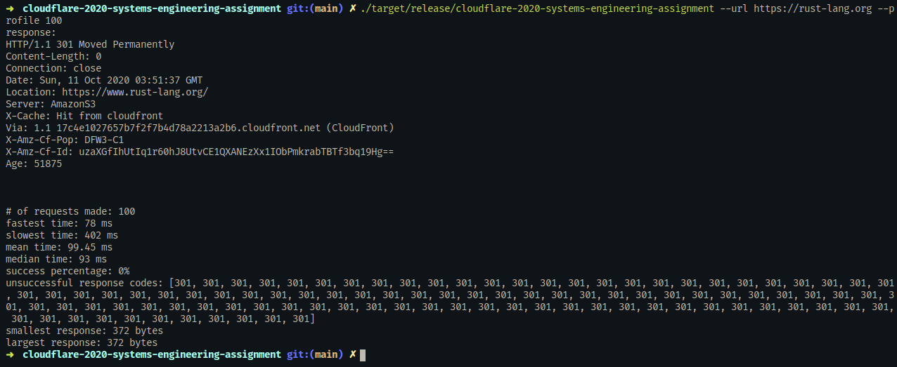
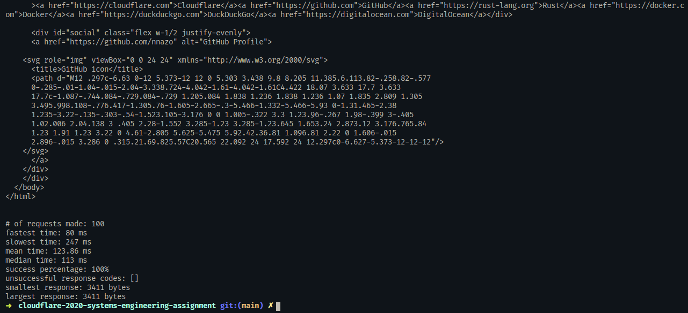

# Systems Engineering Assignment 2020

## Build
You must have Rust and Cargo installed.
1. Install Rust and Cargo if necessary
2. Run `cargo build --release`
3. Execute `./target/release/cloudflare-2020-systems-engineering-assignment` with the desired options.

## Benchmarks
### Links Benchmark


### Another Webpage Benchmark (rust-lang)


### Worker Benchmark

Command run: `./target/release/cloudflare-2020-systems-engineering-assignment --url https://cloudflare-2020-general-engineering-assignment.jacobcurtis2266.workers.dev --profile 100`



### Other Site Benchmark Outputs
Note: omitting returned webpage content due to their length.

Output for https://github.com/nnazo
```
# of requests made: 100
fastest time: 195 ms
slowest time: 1023 ms
mean time: 276.83 ms
median time: 213 ms
success percentage: 49%
error codes: [429, 429, 429, 429, 429, 429, 429, 429, 429, 429, 429, 429, 429, 429, 429, 429, 429, 429, 429, 429, 429, 429, 429, 429, 429, 429, 429, 429, 429, 429, 429, 429, 429, 429, 429, 429, 429, 429, 429, 429, 429, 429, 429, 429, 429, 429, 429, 429, 429, 429, 429]
smallest response: 1474 bytes
largest response: 172206 bytes
```

Output for https://duckduckgo.com
```
# of requests made: 100
fastest time: 168 ms
slowest time: 216 ms
mean time: 189.74 ms
median time: 189 ms
success percentage: 100%
error codes: []
smallest response: 5763 bytes
largest response: 5763 bytes
```

Full output for https://google.com
```
➜  cloudflare-2020-systems-engineering-assignment git:(main) ✗ ./target/release/cloudflare-2020-systems-engineering-assignment --url https://google.com --profile 100
response:
HTTP/1.1 301 Moved Permanently
Location: https://www.google.com/
Content-Type: text/html; charset=UTF-8
Date: Sun, 11 Oct 2020 04:22:50 GMT
Expires: Tue, 10 Nov 2020 04:22:50 GMT
Cache-Control: public, max-age=2592000
Server: gws
Content-Length: 220
X-XSS-Protection: 0
X-Frame-Options: SAMEORIGIN
Alt-Svc: h3-Q050=":443"; ma=2592000,h3-29=":443"; ma=2592000,h3-27=":443"; ma=2592000,h3-T051=":443"; ma=2592000,h3-T050=":443"; ma=2592000,h3-Q046=":443"; ma=2592000,h3-Q043=":443"; ma=2592000,quic=":443"; ma=2592000; v="46,43"
Connection: close

<HTML><HEAD><meta http-equiv="content-type" content="text/html;charset=utf-8">
<TITLE>301 Moved</TITLE></HEAD><BODY>
<H1>301 Moved</H1>
The document has moved
<A HREF="https://www.google.com/">here</A>.
</BODY></HTML>


# of requests made: 100
fastest time: 90 ms
slowest time: 185 ms
mean time: 99.9 ms
median time: 99 ms
success percentage: 100%
error codes: []
smallest response: 220 bytes
largest response: 220 bytes
```

Out of the requests that returned a semi-large HTML webpage, the worker site seemed the fastest for the given response size. The github and request took much longer and returned a response half the size, though requests did get rate-limited in that benchmark. Google had a similar benchmark time but the response was much smaler than the worker site.